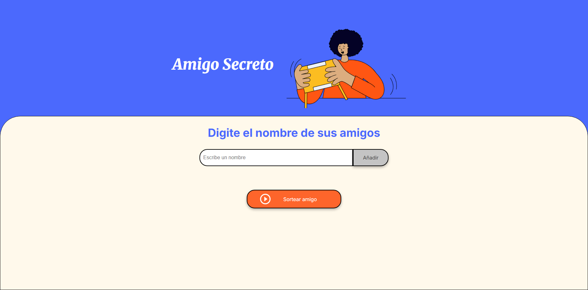
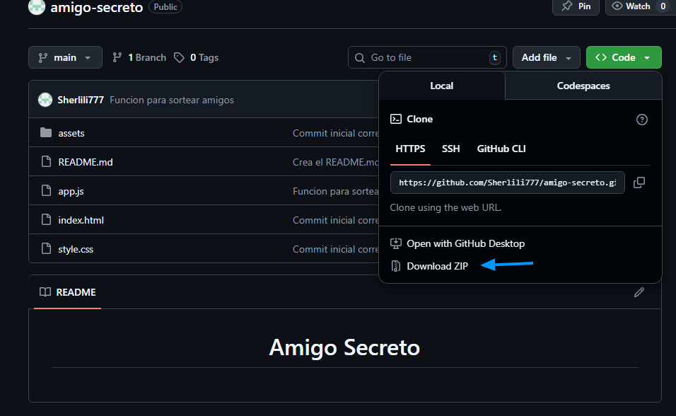
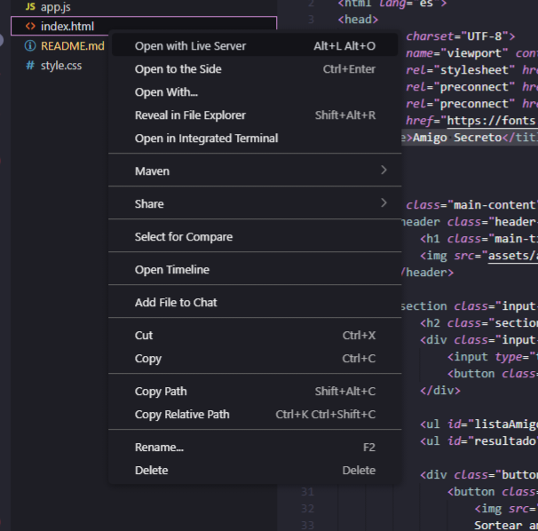
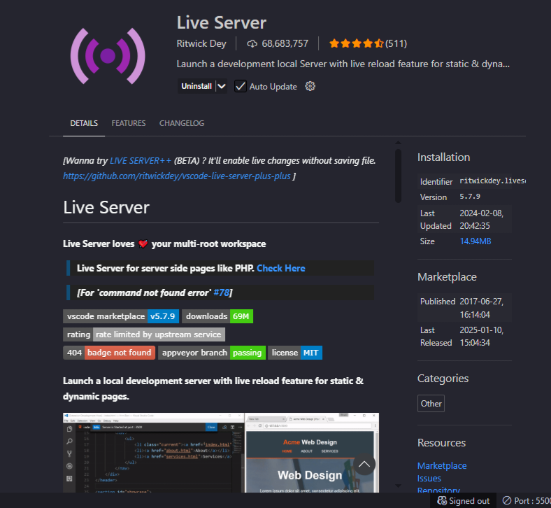

<h1 align="center">Amigo Secreto</h1>

Juego para sortear un amigo secreto de la lista de nombres que ingreses

<h2 aling="center">Indice</h2>

<ul>
  <li>Instalacion</li>
  <li>Uso</li>
  <li>Tecnologias</li>
</ul>

<h2 aling="center">Instalacion</h2>

<mark>Necesitas VS code y extencion de Live Server</mark>

1  Descarga desde el repositorio

2  Extrae en una carpeta

3  Abre en VS code

4  Abre con Live Server

<h2 aling="center">Uso</h2>

1  Escribe los nombres de tus amigos para que aparezcan en la lista.

2  Selecciona "Sortear"

Se sorteara un nombre de tu lista de amigos.

<h2 aling="center">Tecnologias</h2>

HTML, CSS y JavaScript

